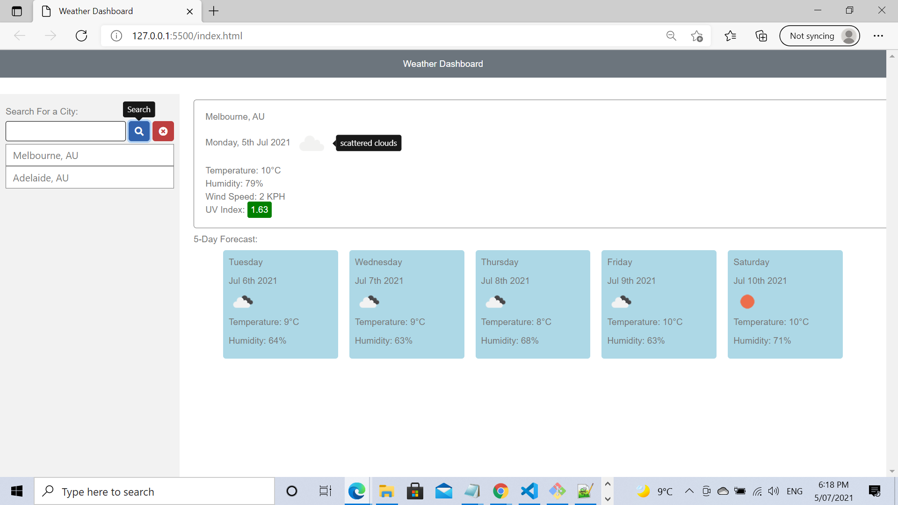
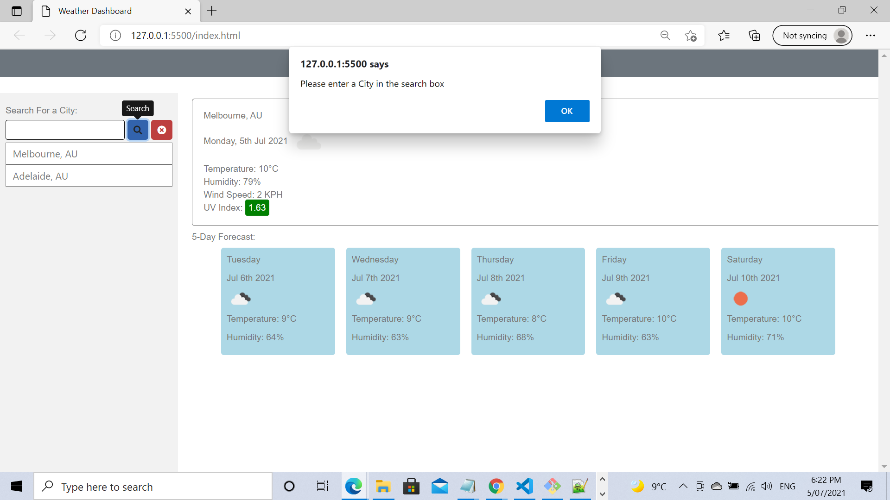
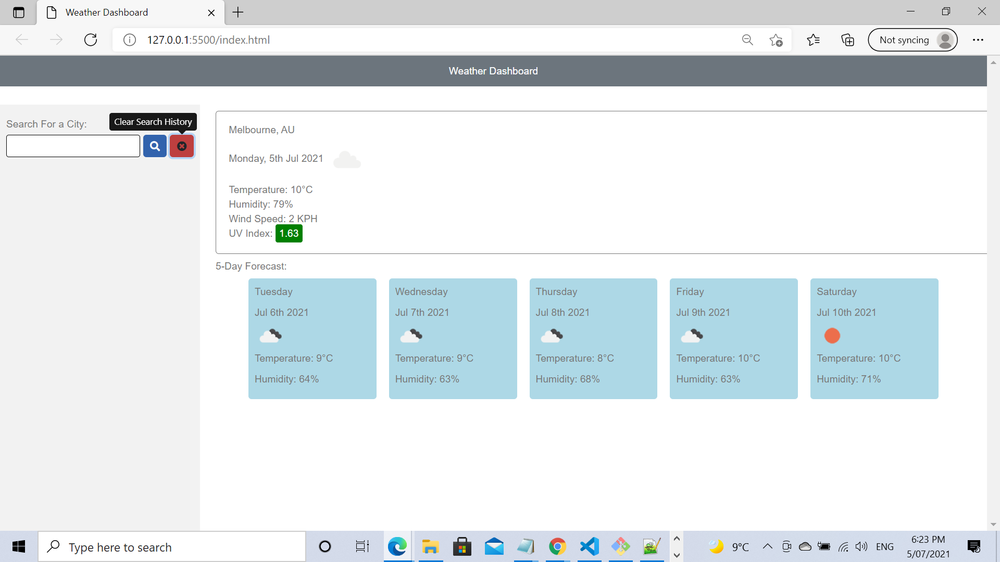
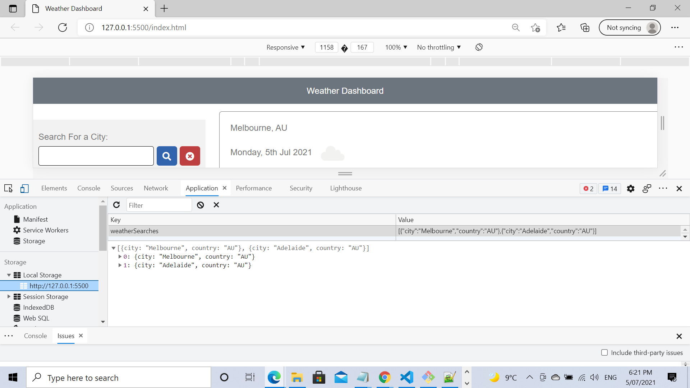

# Weather-Dashboard

# Description

This website/app helps the users to know the current weather condition for a city upon searching.
This website provides the data for the next 5 days. The Searched cities stored and displayed in the UI.
So user can click on those cities and get the weather information on dashboard.

# Installation

Source code :https://github.com/SimonMSelvadurai/Weather-Dashboard

Live Site : https://simonmselvadurai.github.io/Weather-Dashboard/

# Home Page

When the user clicks on the live link, user will be shown the home page.
User can able to see the search button to provide the city names to get the weather information.
User may able to see the present day information and the next 5 days information.

